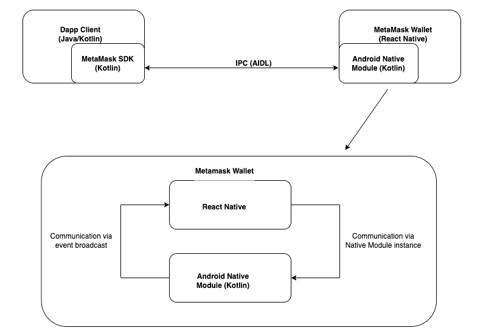

# MetaMask Android SDK Native Module

## Overview
The MetaMask Android SDK Native Module is a Kotlin [Android Native Module](https://reactnative.dev/docs/native-modules-android) embedded in the MetaMask wallet that acts as the server-side of the [Inter Process Communication (IPC)](https://developer.android.com/guide/components/processes-and-threads#IPC) between the MetaMask SDK in the Android dapps and the MetaMask wallet. The IPC mechanism is implemented using the [Android Interface Definition Language (AIDL)](https://developer.android.com/guide/components/aidl).

This module handles encrypted communication between the dapp and MetaMask and then relays the messages over to the Android SDK communication layer implemented in React Native in the wallet. The wallet uses the Native Module interface

This library is embedded as an `.aar` file on MetaMask wallet.

## Architecture
The client SDK communicates with the server SDK (Android Native Module) via IPC implemented using AIDL. 

Communication over the IPC protocol is entirely encrypted using Elliptic Curve Integrated Encryption (ECIES). More information on the mechanics of this encryption can be found in the
[Official SDK documentation ](https://docs.metamask.io/wallet/concepts/sdk/#communication-layer)

The architectural diagram of the communication is illustrated below

